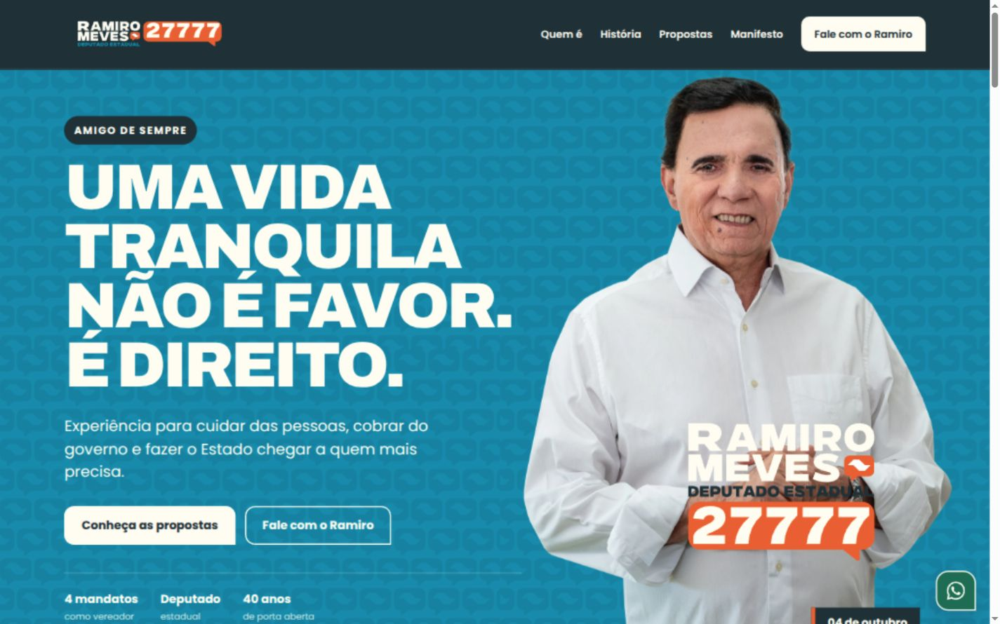
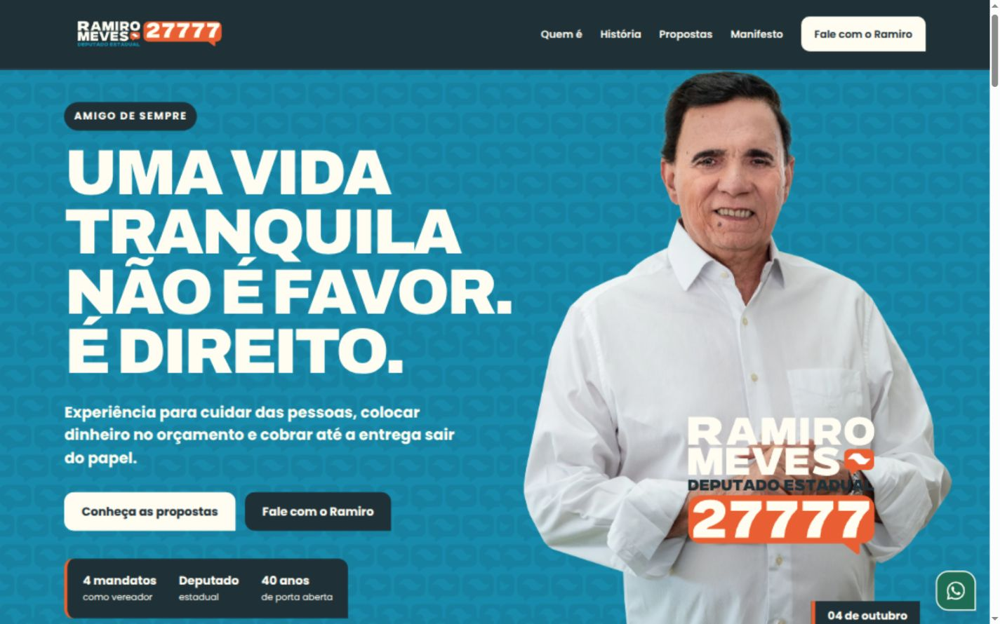
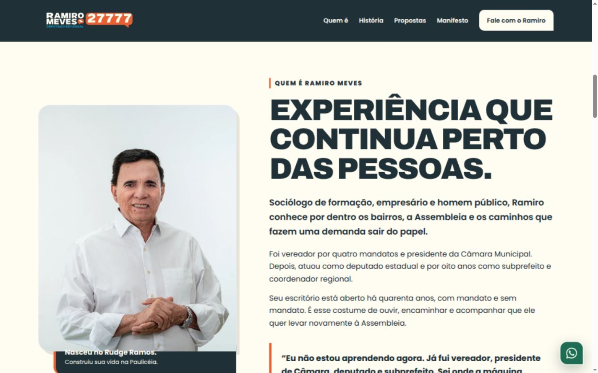
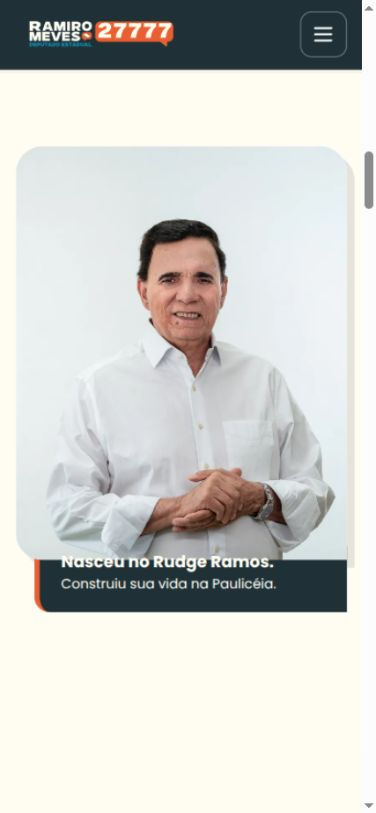
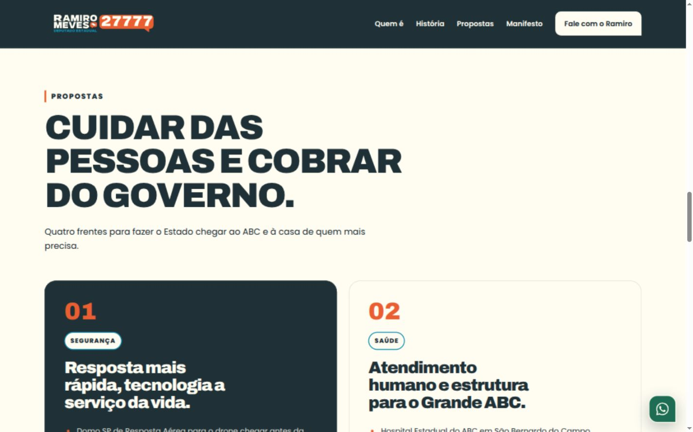
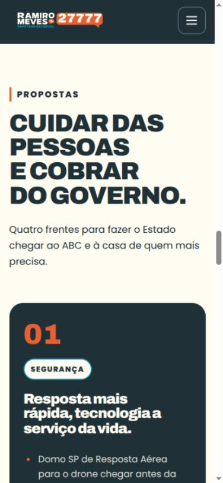
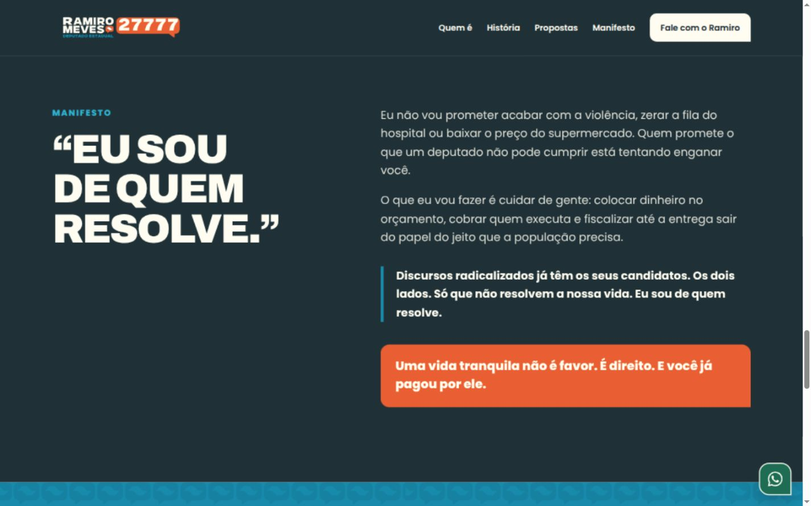
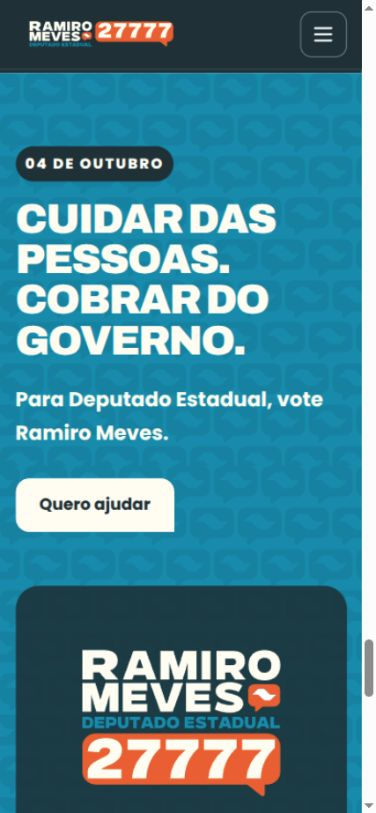

# Auditoria de contraste e conteúdo — 27/08/2026

**Escopo:** one-page local de Ramiro Meves, revisada em desktop (1440 × 900) e celular (390 × 844).

**Saúde geral:** boa. A direção visual está consistente com o material de campanha. A primeira varredura encontrou 22 combinações de texto abaixo do contraste WCAG AA e 7 superfícies em branco puro; depois das correções, a mesma medição terminou com **0 falhas de contraste** e **0 superfícies em branco puro**.

## 1. Hero e chamada principal — saúde: boa após correção

O hero já tinha a hierarquia mais forte do site, com foto, slogan, número e CTA bem reconhecíveis. O problema estava nos textos menores em creme diretamente sobre o azul: visualmente pareciam brancos “sumindo” no fundo, sobretudo no celular.

Foram corrigidos o peso da introdução, o botão secundário e o bloco de comprovação da trajetória. O novo texto de apoio também passou a seguir a lógica aprovada de orçamento, cobrança e entrega.

**Antes**

**Depois**

## 2. Biografia e superfícies claras — saúde: boa após correção

O layout editorial da biografia está forte e coerente com as referências. O branco puro de retrato, citação, cards e redes sociais foi substituído pelo creme oficial da identidade. A legenda laranja sobre a foto também foi convertida em ardósia com detalhe laranja, garantindo leitura para textos pequenos.

A frase-âncora foi restaurada na versão completa aprovada: trajetória como vereador, presidente de Câmara, deputado e subprefeito, seguida da afirmação sobre conhecer onde a máquina pública emperra.

## 3. Propostas — saúde: boa após correção

As quatro frentes previstas estão presentes: Segurança, Saúde, Mulheres e Idosos. Os rótulos pequenos em creme sobre azul foram substituídos por creme com texto ardósia e contorno azul.

Na revisão de conteúdo:

- Saúde passou a trazer o dado aprovado de **62% de aumento na adesão ao tratamento** ligado ao treinamento em comunicação clínica.
- Mulheres passou a citar **Delegacia da Mulher 24 horas no ABC** e monitoramento de agressores de alto risco.
- Segurança e Idosos já estavam alinhados à plataforma e foram mantidos.

## 4. Manifesto, voto e contato — saúde: boa após correção

Foi incluído o trecho aprovado que cita explicitamente “os dois lados”, importante para não transformar o contraste político em ataque a um campo só. No bloco de voto, data e texto receberam combinações seguras para o fundo azul. O título de contato agora reproduz a chamada aprovada: **“Fale com nosso time — e com o Ramiro.”**

## 5. Conferência editorial — saúde: consistente com ressalvas documentadas

Foram usados, nesta ordem, o briefing, a plataforma política, o manifesto v3 e o banco de frases. O site agora mantém:

- slogan principal, equação de direitos e chamada de voto definidos no briefing;
- biografia e trajetória compatíveis com o material aprovado;
- quatro eixos de proposta e dados atuais da plataforma;
- tom do manifesto sem prometer atribuições que um deputado não pode cumprir;
- contato, número, partido e identificação legal já fornecidos.

Dados marcados nos próprios materiais como pendentes de verificação — por exemplo, números históricos e alegações ainda sem fonte confirmada — não foram introduzidos no site.

## Evidências técnicas

- [Medição antes](./contraste-computado-antes.json): 107 nós de texto avaliados, 22 falhas AA e 7 superfícies em branco puro.
- [Medição depois — desktop](./contraste-computado-depois.json): 109 nós de texto avaliados, 0 falhas AA e 0 superfícies em branco puro.
- [Medição depois — celular](./contraste-computado-depois-mobile.json): 109 nós de texto avaliados, 0 falhas AA e 0 superfícies em branco puro.
- [Página completa corrigida](./24-pagina-completa-desktop-corrigida.jpg).
- Não houve overflow horizontal em 1440 × 900 nem em 390 × 844.
- O menu móvel abriu, anunciou `aria-expanded="true"` e permaneceu visível para navegação.

## Limites da auditoria

A medição automática cobre cores CSS computadas de textos HTML. Textos incorporados em logos, SVGs e imagens foram avaliados visualmente, não como nós de texto. A revisão editorial confirma aderência ao material fornecido; não substitui checagem jurídica, eleitoral ou factual externa dos documentos de campanha.
